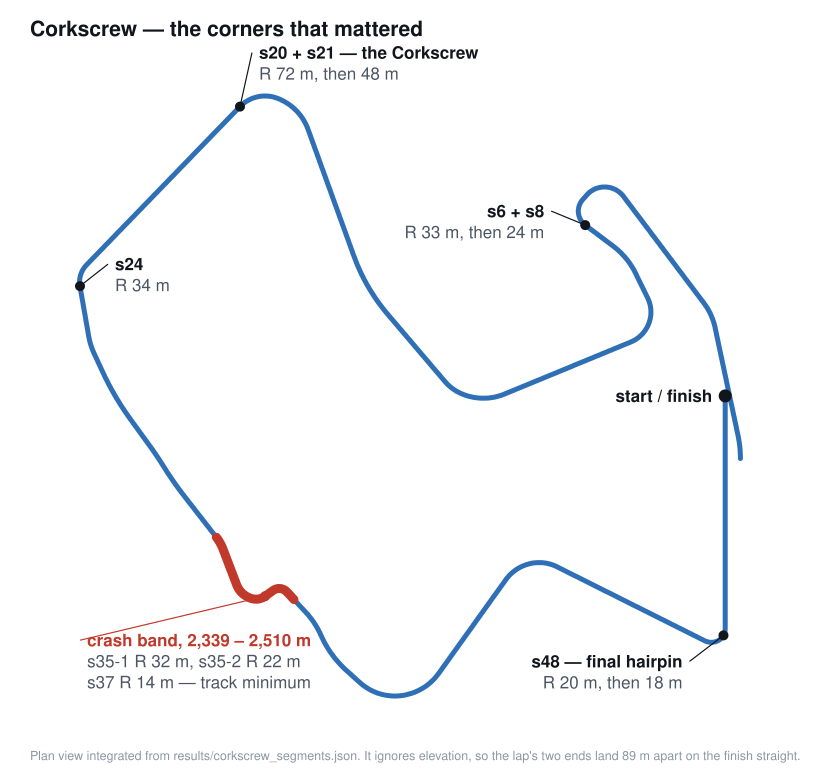
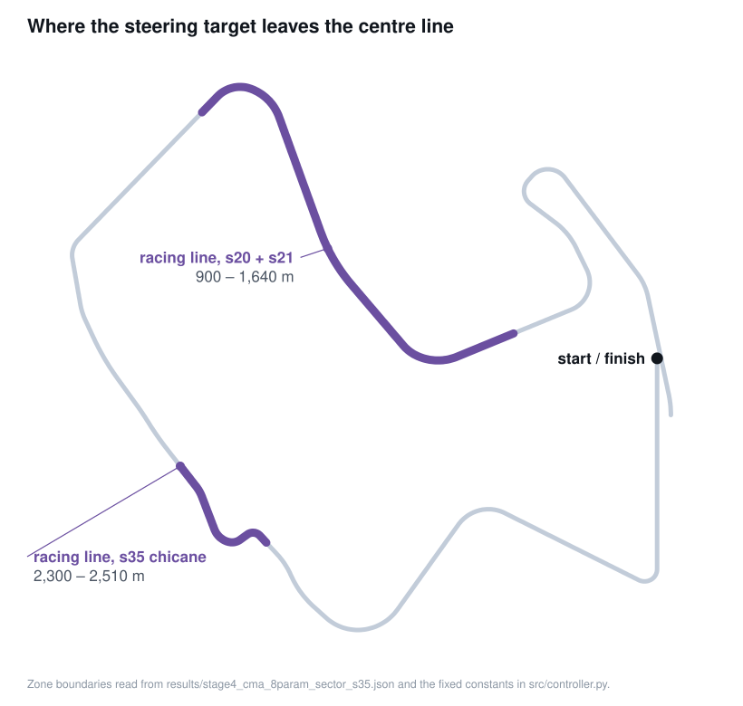
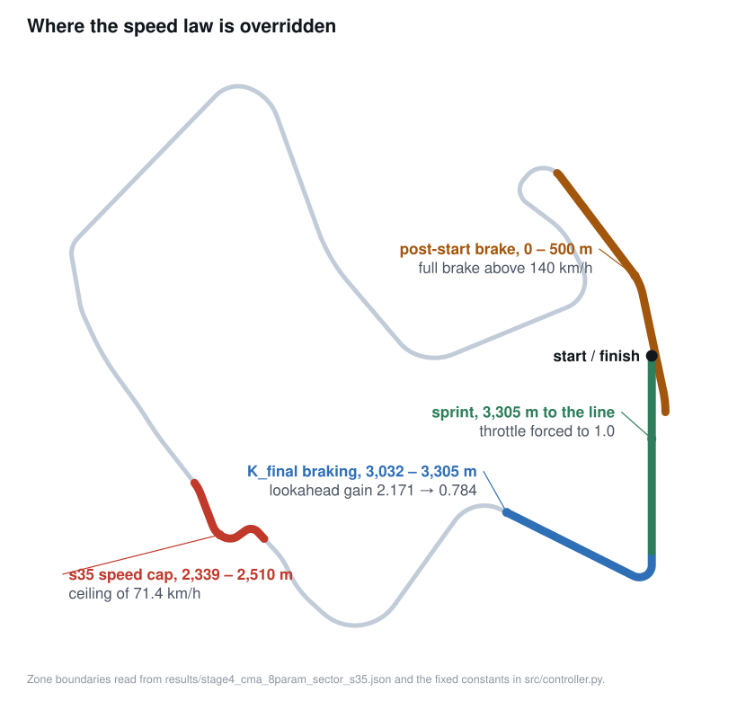

# Corkscrew autonomous racing controller — CMA-ES + residual NN

**English** | [日本語](README.ja.md)

An autonomous driving controller for [TORCS](https://sourceforge.net/projects/torcs/),
taken from **261.42 s to 106.63 s** on the Corkscrew track — a **59% reduction** in best
warm lap time.

Built for the **IBM AI Racing League**, the client project inside a group-project
module at one of the participating universities (2026). This repository holds **my
individual agent**, not the team's integrated submission — see
[Team boundary](#team-boundary). The university and the module code are left out
on purpose; if you need them to verify this, ask me directly.


```
Rule-based baseline   261.422 s
CMA-ES + residual NN  106.630 s     -59.2%
```

**Start here:** [`src/controller.py`](src/controller.py) is the entire control law as
pure functions — no simulator, no PyTorch, no NumPy — and
[`tests/test_controller.py`](tests/test_controller.py) is 46 tests over it that run on a
bare Python install in under a second:

```bash
python -m unittest discover -s tests
```

---

## The simulator, and what the league scored

**TORCS** is an open-source 3D racing simulator with a proper vehicle model — tyre load
and slip, aerodynamics, gearbox, fuel and damage — and it has been the platform for the
*Simulated Car Racing* (SCR) championship since 2008. The SCR patch adds a driver module,
`scr_server`, that drives nothing itself: it opens a UDP port, publishes the car's sensors
once per control step, and applies whatever command comes back. A controller is therefore
a separate process, in any language, talking to the simulator over a socket. Mine is
Python; `gym_torcs` is the bridge that speaks the protocol.

**What the controller can see.** One UDP message per control step:

| Sensor | Meaning |
|---|---|
| `track[0..18]` | 19 rangefinder beams to the track edge, in metres, saturating at 200 m |
| `angle` | angle between the car's heading and the track direction, radians |
| `trackPos` | lateral position, normalised: 0 = centre line, ±1 = on the edge |
| `speedX/Y/Z` | body-frame velocity, km/h |
| `distRaced` | distance covered since the session started, metres |
| `curLapTime`, `lastLapTime` | timing |
| `rpm`, `gear`, `wheelSpinVel`, `damage`, `fuel` | drivetrain and car state |

The beams are not evenly spaced. The bridge requests
`-45 -19 -12 -7 -4 -2.5 -1.7 -1 -0.5 0 0.5 1 1.7 2.5 4 7 12 19 45` degrees, which spends
almost all of the resolution near straight ahead. `track[9]` is the beam pointing exactly
forwards, and it reads the distance to wherever the track first turns away — on a straight
it saturates, and it collapses as a corner approaches. That one number is the entire input
to the speed subsystem below. The sensor layout is not a detail here; it is the reason a
lookahead controller is the natural shape of solution.

**What it commands.** `steer` in [−1, +1], and a single signed throttle in [−1, +1] where
positive is accelerator and negative is brake. Gear selection is left to the bridge's
speed thresholds — the controller never shifts. One command per control step, every 20 ms
of simulated time (`RCM_MAX_DT_ROBOTS` in the TORCS source carried in the pinned image),
so a 108 s lap is roughly 5,400 decisions.

**What was scored.** The **best warm lap** on Corkscrew. Lap 1 starts from rest on the
grid and does not count; the measured lap is lap 2 onwards, taken with the car already at
speed. The session is a solo practice run — no opponents, no traffic — so nothing stands
between the controller and the clock. Corkscrew is 3,608 m long with corner radii from
480 m down to 14 m.

The supplied reference driver, `snakeoil`, is a fixed rule-based controller whose entire
steering law is `steer = angle · 10/π − trackPos · 0.10`, with a speed cap and a crude
automatic throttle. It laps Corkscrew in 261.42 s. That was the number to beat.

## The track

Corkscrew is not a track you can reason about from a lap time. It is a 3,608 m circuit
with a 225 m finish straight, two tight left-hand complexes, and a 14 m-radius corner —
and the two things that mattered most in this project, the intermittent crash band and the
final hairpin, are 800 m apart and look nothing alike.

Before any optimisation ran, I parsed the track definition into a segment table — every
section with its type, radius, arc and cumulative distance
([`src/analyze_track.py`](src/analyze_track.py) →
[`results/corkscrew_segments.json`](results/corkscrew_segments.json),
[`docs/corkscrew_analysis.md`](docs/corkscrew_analysis.md)). This map is that table drawn
to scale: the plan view is integrated from the segment lengths, radii and arc angles, so
nothing on it is placed by hand.



The eight tightest corners, which are what the speed subsystem has to survive:

| Segment | distRaced | Radius |
|---|---|---|
| s37 | 2,495 m | 14 m |
| s48-2 | 3,286 m | 18 m |
| s48-1 | 3,268 m | 20 m |
| s35-2 | 2,461 m | 22 m |
| s8 | 598 m | 24 m |
| s35-1 | 2,441 m | 32 m |
| s6 | 550 m | 33 m |
| s24 | 1,940 m | 34 m |

All 66 segments are in [`docs/corkscrew_analysis.md`](docs/corkscrew_analysis.md).

Having exact radii before starting is what later made [the s35
diagnosis](#the-s35-diagnosis) a cross-reference rather than a guess. Most of the value of
that table was collected months after it was written.

## My contribution

Everything in this repository: the control law, the optimisation setup for every stage,
the failure diagnosis, the residual network and its training loop, and the evaluation
harness. What I did **not** write is listed under [Attribution](#attribution).

## Why CMA-ES, and not deep RL

Deep RL was the expected route, and five of my six-person team committed to policy
gradient methods (PPO, SAC). I built an RL agent first and measured two obstacles
rather than assuming them:

1. **Cold start.** A randomly initialised policy leaves the track within seconds. Almost
   every early rollout terminates before it can generate a useful gradient signal.
2. **Sample cost.** Every rollout is a real-time simulator episode. Convergence needed
   thousands of them — days of wall-clock time I did not have inside a one-semester
   project.

So I reframed the task. There was already a controller that could complete a lap; what
it lacked was *tuning*. That makes this black-box optimisation over a handful of
continuous parameters, not policy learning from scratch — and
[CMA-ES](https://en.wikipedia.org/wiki/CMA-ES) is a good fit for exactly that shape of
problem: derivative-free, robust to a noisy objective (lap times vary run to run), and
effective in tens of dimensions or fewer. Critically, it **starts from a policy that
already finishes the lap**, so there is no phase where the search is spending its budget
learning not to crash.

The same reasoning governs the whole design: the parameter count grows only when the
current space is exhausted, and each stage starts from the previous stage's best.

## How CMA-ES was configured

CMA-ES keeps one multivariate normal distribution over the parameter vector and, each
generation, does four things:

1. **Sample.** Draw λ candidate parameter vectors from `N(m, σ²C)`. The mean `m` is the
   current best guess, `σ` the overall step size, and the covariance `C` says which
   directions — and which *combinations* of parameters — are worth exploring.
2. **Evaluate.** Run each candidate. Here that is a live TORCS episode, so λ is small.
3. **Rank.** Sort by fitness, keep the best μ = λ/2. Only the *ordering* is used; the lap
   times themselves never enter the update.
4. **Update.** Move `m` to a weighted mean of those μ, stretch `C` toward the directions
   that just produced improvements, and adapt σ from the length of the path `m` has been
   travelling — a long, consistent path means take bigger steps; a short, jittery one
   means shrink.

Step 3 is the property that made it the right tool. Because the update is rank-based, a
noisy objective measured in raw seconds works as-is: no reward shaping, no normalisation,
no differentiable simulator. And the covariance adaptation *learns* the scaling of the
problem, which matters when steering gain and a sector boundary in metres are being
searched in the same vector.

Concretely, stage 4 ([`src/train_cma_sector.py`](src/train_cma_sector.py)) ran:

| Setting | Value | Why |
|---|---|---|
| Population λ | 8 | Below the library default of 10 for 8 dimensions. Every evaluation is a live four-lap episode, so the population size is set by what the time budget can afford, not by the dimension count. |
| Initial mean | the 122.060 s six-parameter best | Never a random restart. Each stage begins from a policy that already finishes the lap. |
| Per-dimension σ | `[0.07, 0.013, 1.5, 0.013, 0.00016, 0.016, 0.20, 80.0]` | The parameters span five orders of magnitude — `T ≈ 0.009` against `switch_dist ≈ 3,000` — so a single scalar step size would either freeze one dimension or throw the other off the track. Tight on the six already-tuned parameters, wide on the two new ones. |
| Box bounds | e.g. `switch_dist ∈ [2700, 3400]`, `K_final ∈ [0.3, 2.0]` | Confines each parameter to values that mean something: the sector switch can only land between the s45 corners and the s48 hairpin, and `K_final`'s upper end is the value at which it has no effect at all. |
| Budget | 8 h, ~50–60 generations | Checkpointed every generation, so an interrupted run resumes rather than restarts. |

The objective is the part worth reading, because a lap time only exists if the car
finishes a lap:

```python
def _fitness(warm, cold, dist, steps):
    if warm is not None:              # finished a warm lap: score it directly
        return warm
    if cold is not None:              # only finished the standing-start lap
        return cold * 1.2
    if dist > 500 and steps > 100:    # crashed: extrapolate the pace it was holding
        return (steps * 0.02) * TRACK_LAP_M / dist
    return 500.0                      # never got going
```

Minimising, so lower is better. The middle two branches are what keep the search moving.
If every candidate that crashes scores the same, the failures form a flat plateau and the
covariance update has nothing to learn from — the search wanders. Scoring a crash by the
pace it was holding when it stopped turns that plateau into a slope: a candidate that
crashed at 3,000 m while running quickly ranks above one that spun off at the first
corner, and the distribution moves toward the fast-and-nearly-safe region rather than away
from failure in general.

## Iteration timeline

Two parameters at a time, so every improvement could be attributed to a specific
decision.

| Stage | Parameters added | Best warm lap | Committed evidence |
|---|---|---|---|
| Rule-based baseline | — | 261.422 s | [`stage0_baseline_snakeoil.json`](results/stage0_baseline_snakeoil.json) |
| CMA-ES, 3 params | `A`, `B` (steering), `C` (speed cap) | 143.100 s | [`stage1_cma_3param.json`](results/stage1_cma_3param.json) |
| CMA-ES, 5 params | `K` (lookahead gain), `T` (throttle gain) | 124.148 s | [`stage2_cma_5param.json`](results/stage2_cma_5param.json) |
| CMA-ES, 6 params | `D` (steering deadband) | 122.060 s | [`stage3_cma_6param_deadband.json`](results/stage3_cma_6param_deadband.json) |
| CMA-ES, 8 params + s35 cap | `K_final`, `switch_dist`, `C_s35` | 108.692 s | [`stage4_cma_8param_sector_s35.json`](results/stage4_cma_8param_sector_s35.json) |
| Residual NN + ARS | 33 network parameters | 106.630 s | [`stage5_nn_ars_s35.json`](results/stage5_nn_ars_s35.json) + [`models/nn_ars_s35_best.pt`](models/nn_ars_s35_best.pt) |

The controller is split into a steering subsystem and a speed subsystem so that the
search space stays interpretable — when a stage regresses, you can tell which subsystem
caused it. Both are in [`src/controller.py`](src/controller.py):

```
steer     = clip(angle·A/π − deadband(trackPos − target_line, D)·B − Δ trackPos·4, −1, +1)
v_target  = clip(K_eff · track[9], 30, C)          # track[9] = distance dead ahead
throttle  = clip((v_target − speedX) · T, −1, +1)
```

That is the global law, and on its own it is worth about 122 s. The remaining 14 s came
from admitting that one set of constants cannot serve a whole lap, and carving out places
where something else applies. There are six of them, split between the two subsystems.
Every boundary drawn below is read straight out of
[`results/stage4_cma_8param_sector_s35.json`](results/stage4_cma_8param_sector_s35.json),
so neither map can describe a controller other than the committed one.

**Steering** gets two windows where the target line is pulled off the centre of the track:
into the s20+s21 complex, and through the s35 chicane. Outside them the target is the
centre line, and only the gains `A`, `B` and `D` are in play.



**Speed** gets four overrides: a hard brake in the first 500 m of every lap whenever the
car is above 140 km/h, the s35 ceiling, a reduced lookahead gain through the braking
sector into the final hairpin, and full throttle from 3,305 m to the line.



Together the six cover 2,026 m of the 3,608 m lap; the remaining 1,582 m is the single
global law, unchanged. None of them is global, and that was deliberate: an intervention
that applies everywhere cannot be attributed to anything, and cannot be undone without
touching the whole lap. Each of these can be switched off in isolation and re-measured.

Two findings from this phase worth calling out:

**The deadband `D` was not an obvious parameter.** Lap times had plateaued around 124 s
and the remaining loss was visible as a zigzag on the straights: trackPos sensor noise
was provoking continuous micro-corrections. Adding a deadband — ignore lateral error
below `D` entirely — let CMA-ES find `D ≈ 0.083`, straightening the line and taking
2 s off the lap. The hypothesis came first; CMA-ES only tuned it.

**A single lookahead gain could not serve the whole lap.** `K` sets speed from the
distance to the track edge straight ahead. The value that is quick everywhere else
arrives at the R=18–20 m final hairpin far too fast. Splitting the lap into sectors with
`K_final` on the approach fixed it without slowing anything else — the same principle as
the s35 fix below, applied to a different corner.

## The s35 diagnosis

Late in the project, the car began crashing **intermittently** at one place, at speeds
that were safe everywhere else. Intermittent, corner-local failures are where trial and
error gets expensive, so I did not guess.

The segment table from [The track](#the-track) was already sitting in `results/`.
Cross-referencing the `distRaced` value logged at each crash against it put every failure
in one band — the red stretch on [the corner map](#the-track):

| distRaced | Segment | Direction | Radius | Arc |
|---|---|---|---|---|
| 2,441 m | s35-1 | left | 32 m | 52° |
| 2,461 m | s35-2 | left | 22 m | 52° |

Two tight left-handers in immediate succession — a chicane. CMA-ES had converged on a
speed cap that was correct for the long straights and incompatible with this geometry,
and because the corner is short, the cost of entering it too fast showed up as an
occasional crash rather than a consistently slow lap.

The fix was **a sector-local speed ceiling**, `C_s35 = 71.4 km/h` over 2,339–2,510 m,
rather than a global speed reduction or a crash penalty in the fitness function. Both of
those alternatives would have paid for the chicane with time lost on the other 3,400 m
of the lap. This stage alone took the lap from 116 s to **108.692 s**.

`target_speed()` applies it as a ceiling, never a setpoint — inside the chicane, wherever
the lookahead already asks for less than 71.4 km/h, the cap does nothing. There is a test
for that, and one asserting the capped zone still spans the documented crash band.

## Residual NN + ARS

The last 2 s came from a small network layered **on top of** the tuned controller rather
than replacing it:

```
throttle = clip( rule(obs) + 0.2 · NN(obs), −1, +1 )

obs(23) → Linear(32) → ReLU → Linear(32) → ReLU → Linear(1) → Tanh
```

Three design choices carry the whole idea, and each answers one of the reasons deep RL
was impractical here:

- **Zero-initialised output layer.** The residual agent's first evaluation is *exactly*
  the CMA-ES controller. There is no cold start, because the starting policy is already
  a 108.692 s lap. This is the property `test_zero_network_output_is_the_rule_controller`
  pins down.
- **Bounded correction.** At scale 0.2, a saturated network output moves the throttle
  command by 0.2. The network can refine the speed profile; it cannot destroy it.
- **33 trainable parameters.** [Augmented Random
  Search](https://arxiv.org/abs/1803.07055) optimises the output layer only. Each
  evaluation costs a real TORCS lap, so the search space has to be small enough to make
  progress in single-digit hours. Six hours of fine-tuning produced 106.630 s.

The three hand-verified override zones — finish-line sprint, braking sector, post-start
brake — are excluded from network control and applied unconditionally afterwards. There
was no reason to spend samples relearning behaviour that already worked, and no reason to
let the network override a safety behaviour.

Training loop: [`src/train_nn_ars.py`](src/train_nn_ars.py).

## Results

Best warm lap on Corkscrew, league-standard race setup:

| | Time | vs baseline |
|---|---|---|
| Rule-based baseline (`snakeoil`) | 261.422 s | — |
| CMA-ES controller (8 params + s35 cap) | 108.692 s | −58.4% |
| + residual NN (ARS, 6 h) | 106.630 s | −59.2% |

Every one of those was measured solo on an empty circuit — one car on the grid, damage
off, in a 10-lap Quick Race on one Windows laptop. And 106.630 s is not a benchmark run:
it is the best of the 72 evaluations the ARS loop made, so it carries the optimistic bias
that a maximum over noisy draws always carries.
[`docs/RACE_CONDITIONS.md`](docs/RACE_CONDITIONS.md) is the full setup — the race
options, the host, the run procedure, and how the container run differs from it.

Raw per-lap records for the CMA-ES stages up to 122 s are in
[`results/lap_times_raw.csv`](results/lap_times_raw.csv) (573 rows). Its column count
varies by stage because each stage's script appended its own header — it is the original
log, kept as-is rather than tidied after the fact.

The individual agent completed the race. The team's integrated version, which combined
several members' approaches, did not.

## Reproducing this

Every stage in the table above now has a file behind it, the residual network included.
What differs between them is not whether the artefact exists — it is where each number
has been measured.

**Runs today**, given TORCS and gym_torcs (see [Reproduction](#reproduction)):

- the **108.692 s** CMA-ES controller — parameters are committed, `--no-nn` drives it
- the **106.630 s** residual agent — `src/run_eval.py` loads
  [`models/nn_ars_s35_best.pt`](models/nn_ars_s35_best.pt) by default
- every earlier stage's parameters
- [`src/train_nn_ars.py`](src/train_nn_ars.py), the ARS training loop that produced the
  106.630 s result, end to end from the committed 108.692 s base
- the track segment analysis, from your own TORCS install
- all three track maps and the progression chart, from the committed results
- the control law itself, via the test suite, with nothing installed at all

**The weights, and what publishing them settles.** `models/nn_ars_s35_best.pt` — the 33
output-layer parameters from the 106.630 s run, on top of the hidden layers they were
searched over — spent four months outside version control, because `*.pt` sat in
`.gitignore`. It was never lost, only unpublished, and it is now committed with its
SHA-256 and a check that loads it and pins its output on fixed inputs:

```bash
python src/verify_weights.py --checksum-only   # bytes only, no Torch needed
python src/verify_weights.py                   # + load and evaluate
```

That settles the artefact. It does not settle the lap.
[`models/README.md`](models/README.md) is the full record: what ARS searched, what came
from a behaviour-cloning warm start, and what each check does and does not prove.

**Where it has been reproduced:** on the original Windows machine, in May 2026, and
nowhere since. The environment was never containerised (see
[Limitations](#limitations)). `container/` pins the environment for the 108.692 s CMA-ES
stage and has re-raced it — 108.538 s, five times, on a different machine and a different
architecture. The residual-NN stage has not had that treatment, so **106.630 s is a
recorded measurement, not a portable one**, and nothing here claims otherwise. Closing
that gap is what is left on
[issue #1](https://github.com/sean-from-japan/torcs-racing-controller/issues/1).

The weights are an output, not the method. Everything that produced them is here: the
residual formulation, the zero-initialised output layer that guarantees a working
starting policy, the 33-parameter search space, the excluded override zones, and the
objective. Re-running it is a six-hour training job against the committed base, not a
reconstruction — and it converges on its own weights and its own time, which is why the
file mattered.

**Two intermediate figures** quoted in my project report — 116.062 s (8-param sector) and
112.404 s (finish-straight sprint) — have no committed artefact either. They are omitted
from the tables above; the next committed measurement after 122.060 s is 108.692 s, which
includes both of those changes.

**Exact lap times** depend on the TORCS build, the nine gym_torcs edits below, and the race
setup. Expect to land near a published number, not on it — see
[Limitations](#limitations) on why the environment, not just the code, needed pinning.

## Reproduction

```bash
git clone https://github.com/sean-from-japan/torcs-racing-controller.git
cd torcs-racing-controller

# 1. Control law only — no simulator, no dependencies
python -m unittest discover -s tests

# 2. Regenerate the figures from results/
python src/make_figure.py
python src/make_track_map.py

# 3. Regenerate the track analysis from your own TORCS install
python src/analyze_track.py --xml /path/to/torcs/tracks/road/corkscrew/corkscrew.xml

# 4. Drive it, in the organiser's pinned container (see container/README.md)
bash container/build.sh               # once: bake the bridge into a derived image
bash container/run.sh --race          # CMA-ES controller on Corkscrew
bash container/run.sh --race --nn     # residual-NN controller on Corkscrew
```

Steps 1–3 need only a Python interpreter. Step 4 needs a container engine and about
25 GB of free disk; it pulls a pinned image, rebuilds the simulator bridge from
upstream sources, puts TORCS on the grid, and writes a result record. Measured on
an Apple Silicon Mac on 2026-09-02: **108.538 s** best warm lap, against the
historical 108.692 s reference. [`container/README.md`](container/README.md) has the
full account, including what is and is not reproducible.

To drive it against your own TORCS install instead:

```bash
pip install -r requirements.txt
python container/prepare_bridge.py --src /path/to/gym_torcs --out third_party/gym_torcs
python container/configure_race.py            # Corkscrew + scr_server
# launch torcs → RACE → PRACTICE → NEW RACE, then:
python -m src.run_eval --no-nn --no-wait
```

That additionally needs:

- **TORCS** patched with the SCR competition server extensions, and the Corkscrew track.
- **[gym_torcs](https://github.com/ugo-nama-kun/gym_torcs)** (MIT, Naoto Yoshida) at
  commit `da5d6dd`. It is not vendored here — see [Attribution](#attribution).
- **The bridge edits that were in force when these times were recorded.** There are
  nine of them, not the two an earlier version of this README claimed, and they are
  not all cosmetic — upstream gym_torcs locks the car in first gear, so stock
  gym_torcs does not reproduce these lap times at all. `prepare_bridge.py` applies
  them from a verified upstream checkout and refuses to run against anything else;
  [`container/README.md`](container/README.md#the-bridge-and-why-it-is-rebuilt-rather-than-shipped)
  lists each one and why it matters.

`run_eval.py` deliberately performs a throwaway lap before the measured run: the ARS
training loop always evaluated a candidate on the *second* environment reset of a
session, and TORCS does not behave identically on the first. Skipping it changes the lap
time. The docstring explains the sequence.

## AI assistance

Stated plainly, because it was a condition of the project and because the commit history
records it either way.

**What AI tools did.** IBM Granite (`granite3.2:8b` for reasoning, `granite-code:8b` for
code generation) ran fully offline through Ollama and produced scaffolding for state
extraction and reward computation. Later I used IBM Bob, an autonomous multi-file coding
agent, for four maintenance tasks: refactoring tests onto shared pytest fixtures,
extracting CMA-ES constants into a config file, documenting archived scripts, and
clearing type-checker errors. Anthropic's Claude was used as a coding assistant
throughout; commits in the original repository carry `Co-Authored-By: Claude` trailers,
and this repository's packaging — the extraction of `controller.py`, the test suite, and
this README — was likewise written with it. Google's Gemini was consulted once, on the
choice of per-dimension CMA-ES step sizes; the comment recording that is still in
[`src/train_cma_5param.py`](src/train_cma_5param.py). Granite also served as a
translation aid:
I develop technical reasoning in Japanese and needed it in precise English for
documentation and an English-only team.

**What AI tools did not do.** The problem framing, the decision to abandon RL for
black-box optimisation, the parameter staging, the deadband and sector hypotheses, the
s35 diagnosis, the residual architecture, and the reading of every result were mine.
Generated code was integrated only after it produced a measurable result in the
simulator; nothing here was accepted because it looked plausible.

**The position I took in the assessed report, which I still hold:** institutional
endorsement of a tool does not transfer accountability from the engineer to the tool. For
an autonomous agent, the specification *is* the accountability artefact — the one
correction Bob needed came from a constraint I failed to state, not from a limitation in
Bob. I am accountable for this system regardless of how any line of it was produced.

## Team boundary

The AI Racing League project was a six-person, English-only team with IBM as the client:
weekly client meetings, code review, a demo, and an individual report.

**This repository contains only my individual agent.** The lap times here were achieved
by my controller alone. I have not included any teammate's code, the team's integrated
submission, or shared deliverables, and teammates are not named. Where the narrative
above describes a team decision — the RL commitment — it is included because it explains
my own technical choice, and I have described only my part in it.

The course assessed this work at 89/100. I am not making any claim about placement in the
league: I do not have access to the final standings and will not assert one.

## Limitations

- **The environment was never containerised.** Development ran against a TORCS install on
  one machine, patched by hand — the nine `gym_torcs.py` edits under
  [Reproduction](#reproduction) are a symptom of that. `container/` has since pinned that
  environment and re-raced the CMA-ES stage on different hardware, but the residual-NN
  stage has not been re-raced anywhere, so 106.630 s remains a single-machine
  measurement. A container from the start would have made both the training run and the
  recorded lap portable, and it is the first change I would make to this project.
- **The trained weights were outside version control for four months.** `*.pt` was in
  `.gitignore`, so the one artefact that could not be regenerated cheaply was the one
  artefact not tracked. It survived on the development machine and is committed now
  (see [`models/README.md`](models/README.md)), but that was luck, not process. What an
  ignore rule excludes should be decided per-file when the file is an experimental
  result.
- **One track, one car, one race setup.** Every parameter is fitted to Corkscrew.
  `results/` contains no evidence of generalisation, and I would expect very little —
  the racing-line profiles and the s35 cap are hard-coded to specific distances on this
  circuit.
- **Zone boundaries were hand-set, not optimised.** The racing-line window edges
  (900/1420/1516/1640 m and 2300/2411/2441/2510 m) and the residual scale of 0.2 were
  chosen by hand. Only the values inside them were searched.
- **Noisy single-run fitness.** Each candidate was scored on the best warm lap of one
  episode. Repeated evaluation would have given a more honest fitness signal, but at a
  simulator cost the project budget could not carry — so some of the difference between
  neighbouring stages is run-to-run variance, not real improvement. This applies hardest
  to the headline number: see [`docs/RACE_CONDITIONS.md`](docs/RACE_CONDITIONS.md).
- **Rationale was not logged alongside results.** Lap times were recorded automatically;
  the reasoning behind each parameter expansion was not. Reconstructing this repository
  from the raw artefacts was harder than it needed to be, which is the strongest argument
  I have for treating rationale logging as part of the result.
- **The training scripts were not refactored** onto `controller.py`. Each stage predates
  the final control law, and rewriting them against it would misrepresent what was
  actually run.

## Repository layout

```
src/controller.py         the control law, pure functions, no dependencies
src/run_eval.py           reproduction runner (needs TORCS)
src/train_cma_5param.py   stage 3 training script, unmodified logic
src/train_cma_sector.py   stage 4 training script, unmodified logic
src/train_nn_ars.py       residual NN + ARS training loop
src/analyze_track.py      TORCS track XML → segment table
src/make_figure.py        results/ → figures/lap_time_progression.svg
src/make_track_map.py     segments + parameters → the three Corkscrew track maps
src/verify_weights.py     checksum + load check for the residual-NN weights
src/torcs_env.py          locates the gym_torcs bridge; the only file that imports it
models/nn_ars_s35_best.pt residual-NN weights from the 106.630 s run + provenance note
results/                  measured parameters per stage + raw lap log + track segments
docs/corkscrew_analysis.md  corner map used for the s35 diagnosis
docs/RACE_CONDITIONS.md     the setup every lap time was measured in
docs/PROVENANCE.md          origin of every file, what was excluded, what was checked
tests/test_controller.py  46 tests, stdlib only
```

## Changes from the original working copy

This repository was assembled from a private project repository. It is not a history
rewrite of that repository — it is a curated extraction, so the code differs in these
ways and no others:

1. **`controller.py` extracted.** The control law existed as two identical inline copies
   in the training script and the runner. It is now one module, imported by both. The
   extraction was verified behaviour-preserving against the original inline code over
   400,000 randomised states — including every zone boundary — with **zero difference**
   in steering and throttle output at full float precision.
2. **gym_torcs is no longer vendored.** The original bundled a pinned copy along with the
   TORCS C sources (~509 MB of game data excluded by `.gitignore`). `src/torcs_env.py`
   now locates your own checkout.
3. **Output paths made repository-relative**, and training-run outputs directed to
   `runs/`, so scripts no longer depend on the working directory.
4. **Files renamed** to describe their stage rather than the date they were produced;
   [`results/README.md`](results/README.md) maps every file to its original name.
5. **Excluded**: course handouts, IBM and university materials, assessed reports, slides,
   internal prompt libraries, training checkpoints, archived experiments and work logs.

Two later corrections, from actually running the thing in a container on 2026-09-02:

6. **`run_eval.py` clears `sys.argv` again.** `snakeoil3_gym.Client` re-parses `sys.argv`
   with `getopt` when it is constructed and aborts on any flag it does not recognise. The
   private runner cleared `sys.argv` before creating the environment; that line was lost
   in the extraction, which meant every documented flag — `--no-nn` included — killed the
   run before the car moved. Restored, with a comment saying why. It also gained
   `--no-wait` for non-interactive runs; the interactive prompt is still the default.
7. **The bridge is rebuilt, not described.** `container/prepare_bridge.py` applies the
   nine edits from a verified upstream checkout, replacing a README paragraph that
   described two of them.

## Attribution

| Component | Origin | Licence |
|---|---|---|
| `src/`, `tests/`, `docs/`, `figures/`, results data | Mine | see below |
| gym_torcs bridge (`gym_torcs.py`, `snakeoil3_gym.py`) | [ugo-nama-kun/gym_torcs](https://github.com/ugo-nama-kun/gym_torcs), Naoto Yoshida | MIT — **not redistributed here** |
| `snakeoil` client, and the baseline driver it provides | Chris X Edwards, via the SCR competition | bundled in gym_torcs — **not redistributed here** |
| TORCS simulator and the Corkscrew track | [TORCS](https://sourceforge.net/projects/torcs/) | GPL-2.0 — **not redistributed here** |
| `results/corkscrew_segments.json`, `docs/corkscrew_analysis.md` | Measurements I extracted from the TORCS Corkscrew track definition with `src/analyze_track.py` | derived from GPL-2.0 track data |

**No licence file is included, deliberately.** This work was produced inside a university
module with an industry client, and I have not confirmed who holds rights over coursework
output. Adding a licence I am not certain I can grant would be worse than leaving the
question open, so default copyright applies: read it, assess it, and ask me before reusing
any of it. Full provenance — what came from where, what was excluded and why, and what was
checked — is in [`docs/PROVENANCE.md`](docs/PROVENANCE.md).

---

Written by [sean-from-japan](https://github.com/sean-from-japan).
