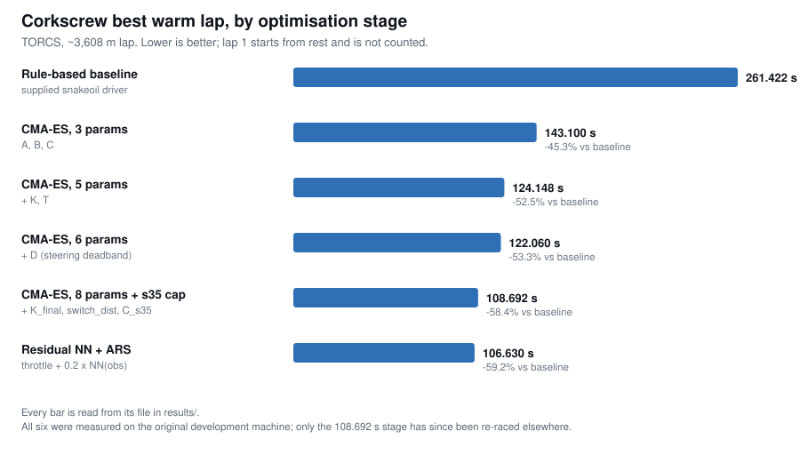

# Corkscrew autonomous racing controller — CMA-ES + residual NN

An autonomous driving controller for [TORCS](https://sourceforge.net/projects/torcs/),
taken from **261.42 s to 106.63 s** on the Corkscrew track — a **59% reduction** in best
warm lap time.

Built for the **IBM AI Racing League**, the client project inside a group-project
module at one of the participating universities (2026). This repository holds **my
individual agent**, not the team's integrated submission — see
[Team boundary](#team-boundary). The university and the module code are left out
on purpose; if you need them to verify this, ask me directly.



```
Rule-based baseline   261.422 s
CMA-ES + residual NN  106.630 s     -59.2%
```

**Start here:** [`src/controller.py`](src/controller.py) is the entire control law as
pure functions — no simulator, no PyTorch, no NumPy — and
[`tests/test_controller.py`](tests/test_controller.py) is 46 tests over it that run on a
bare Python install in under a second:

```bash
python -m unittest discover -s tests
```

---

## The problem

TORCS exposes a car through 19 range sensors plus speed, heading angle and lateral
track position, and expects a steering and throttle command every 20 ms. The league
scored the **best warm lap** (lap 2 onwards; lap 1 starts from rest and does not count)
on Corkscrew, a 3,608 m circuit whose corner radii range from 480 m down to 14 m.

The supplied reference driver — `snakeoil`, a fixed rule-based controller — laps it in
261.42 s. That was the number to beat.

## My contribution

Everything in this repository: the control law, the optimisation setup for every stage,
the failure diagnosis, the residual network and its training loop, and the evaluation
harness. What I did **not** write is listed under [Attribution](#attribution).

## Why CMA-ES, and not deep RL

Deep RL was the expected route, and five of my six-person team committed to policy
gradient methods (PPO, SAC). I built an RL agent first and measured two obstacles
rather than assuming them:

1. **Cold start.** A randomly initialised policy leaves the track within seconds. Almost
   every early rollout terminates before it can generate a useful gradient signal.
2. **Sample cost.** Every rollout is a real-time simulator episode. Convergence needed
   thousands of them — days of wall-clock time I did not have inside a one-semester
   project.

So I reframed the task. There was already a controller that could complete a lap; what
it lacked was *tuning*. That makes this black-box optimisation over a handful of
continuous parameters, not policy learning from scratch — and
[CMA-ES](https://en.wikipedia.org/wiki/CMA-ES) is a good fit for exactly that shape of
problem: derivative-free, robust to a noisy objective (lap times vary run to run), and
effective in tens of dimensions or fewer. Critically, it **starts from a policy that
already finishes the lap**, so there is no phase where the search is spending its budget
learning not to crash.

The same reasoning governs the whole design: the parameter count grows only when the
current space is exhausted, and each stage starts from the previous stage's best.

## Iteration timeline

Two parameters at a time, so every improvement could be attributed to a specific
decision.

| Stage | Parameters added | Best warm lap | Committed evidence |
|---|---|---|---|
| Rule-based baseline | — | 261.422 s | [`stage0_baseline_snakeoil.json`](results/stage0_baseline_snakeoil.json) |
| CMA-ES, 3 params | `A`, `B` (steering), `C` (speed cap) | 143.100 s | [`stage1_cma_3param.json`](results/stage1_cma_3param.json) |
| CMA-ES, 5 params | `K` (lookahead gain), `T` (throttle gain) | 124.148 s | [`stage2_cma_5param.json`](results/stage2_cma_5param.json) |
| CMA-ES, 6 params | `D` (steering deadband) | 122.060 s | [`stage3_cma_6param_deadband.json`](results/stage3_cma_6param_deadband.json) |
| CMA-ES, 8 params + s35 cap | `K_final`, `switch_dist`, `C_s35` | 108.692 s | [`stage4_cma_8param_sector_s35.json`](results/stage4_cma_8param_sector_s35.json) |
| Residual NN + ARS | 33 network parameters | 106.630 s | trained weights not archived — see [Reproducing this](#reproducing-this) |

The controller is split into a steering subsystem and a speed subsystem so that the
search space stays interpretable — when a stage regresses, you can tell which subsystem
caused it. Both are in [`src/controller.py`](src/controller.py):

```
steer     = clip(angle·A/π − deadband(trackPos − target_line, D)·B − Δ trackPos·4, −1, +1)
v_target  = clip(K_eff · track[9], 30, C)          # track[9] = distance dead ahead
throttle  = clip((v_target − speedX) · T, −1, +1)
```

Two findings from this phase worth calling out:

**The deadband `D` was not an obvious parameter.** Lap times had plateaued around 124 s
and the remaining loss was visible as a zigzag on the straights: trackPos sensor noise
was provoking continuous micro-corrections. Adding a deadband — ignore lateral error
below `D` entirely — let CMA-ES find `D ≈ 0.083`, straightening the line and taking
2 s off the lap. The hypothesis came first; CMA-ES only tuned it.

**A single lookahead gain could not serve the whole lap.** `K` sets speed from the
distance to the track edge straight ahead. The value that is quick everywhere else
arrives at the R=18–20 m final hairpin far too fast. Splitting the lap into sectors with
`K_final` on the approach fixed it without slowing anything else — the same principle as
the s35 fix below, applied to a different corner.

## The s35 diagnosis

Late in the project, the car began crashing **intermittently** at one place, at speeds
that were safe everywhere else. Intermittent, corner-local failures are where trial and
error gets expensive, so I did not guess.

Before optimisation began I had parsed the Corkscrew track definition into a segment
table — every section with its type, radius, arc and cumulative distance
([`src/analyze_track.py`](src/analyze_track.py) →
[`results/corkscrew_segments.json`](results/corkscrew_segments.json),
[`docs/corkscrew_analysis.md`](docs/corkscrew_analysis.md)). Cross-referencing the
`distRaced` value at each crash against that table put every failure in one band:

| distRaced | Segment | Direction | Radius | Arc |
|---|---|---|---|---|
| 2,441 m | s35-1 | left | 32 m | 52° |
| 2,461 m | s35-2 | left | 22 m | 52° |

Two tight left-handers in immediate succession — a chicane. CMA-ES had converged on a
speed cap that was correct for the long straights and incompatible with this geometry,
and because the corner is short, the cost of entering it too fast showed up as an
occasional crash rather than a consistently slow lap.

The fix was **a sector-local speed ceiling**, `C_s35 = 71.4 km/h` over 2,339–2,510 m,
rather than a global speed reduction or a crash penalty in the fitness function. Both of
those alternatives would have paid for the chicane with time lost on the other 3,400 m
of the lap. This stage alone took the lap from 116 s to **108.692 s**.

`target_speed()` applies it as a ceiling, never a setpoint — inside the chicane, wherever
the lookahead already asks for less than 71.4 km/h, the cap does nothing. There is a test
for that, and one asserting the capped zone still spans the documented crash band.

## Residual NN + ARS

The last 2 s came from a small network layered **on top of** the tuned controller rather
than replacing it:

```
throttle = clip( rule(obs) + 0.2 · NN(obs), −1, +1 )

obs(23) → Linear(32) → ReLU → Linear(32) → ReLU → Linear(1) → Tanh
```

Three design choices carry the whole idea, and each answers one of the reasons deep RL
was impractical here:

- **Zero-initialised output layer.** The residual agent's first evaluation is *exactly*
  the CMA-ES controller. There is no cold start, because the starting policy is already
  a 108.692 s lap. This is the property `test_zero_network_output_is_the_rule_controller`
  pins down.
- **Bounded correction.** At scale 0.2, a saturated network output moves the throttle
  command by 0.2. The network can refine the speed profile; it cannot destroy it.
- **33 trainable parameters.** [Augmented Random
  Search](https://arxiv.org/abs/1803.07055) optimises the output layer only. Each
  evaluation costs a real TORCS lap, so the search space has to be small enough to make
  progress in single-digit hours. Six hours of fine-tuning produced 106.630 s.

The three hand-verified override zones — finish-line sprint, braking sector, post-start
brake — are excluded from network control and applied unconditionally afterwards. There
was no reason to spend samples relearning behaviour that already worked, and no reason to
let the network override a safety behaviour.

Training loop: [`src/train_nn_ars.py`](src/train_nn_ars.py).

## Results

Best warm lap on Corkscrew, league-standard race setup:

| | Time | vs baseline |
|---|---|---|
| Rule-based baseline (`snakeoil`) | 261.422 s | — |
| CMA-ES controller (8 params + s35 cap) | 108.692 s | −58.4% |
| + residual NN (ARS, 6 h) | 106.630 s | −59.2% |

Raw per-lap records for the CMA-ES stages up to 122 s are in
[`results/lap_times_raw.csv`](results/lap_times_raw.csv) (573 rows). Its column count
varies by stage because each stage's script appended its own header — it is the original
log, kept as-is rather than tidied after the fact.

The individual agent completed the race. The team's integrated version, which combined
several members' approaches, did not.

## Reproducing this

The agent runs. What was not archived is one file: the output-layer weights the residual
network converged on in the recorded run.

**Runs today**, given TORCS and gym_torcs (see [Reproduction](#reproduction)):

- the **108.692 s** CMA-ES controller — parameters are committed, `--no-nn` drives it
- every earlier stage's parameters
- [`src/train_nn_ars.py`](src/train_nn_ars.py), the ARS training loop that produced the
  106.630 s result, end to end from the committed 108.692 s base
- the track segment analysis, from your own TORCS install
- the control law itself, via the test suite, with nothing installed at all

**Not archived:** `models/nn_ars_s35_best.pt` — the 33 output-layer weights from the
106.630 s run — was never committed (`*.pt` sat in `.gitignore`), and is in no branch of
either project repository. The *specific* recorded lap therefore cannot be replayed from
this repository; a fresh ARS run would converge on its own weights and its own time.
`run_eval.py` says so and exits rather than pretend, and the chart marks that stage as
having no committed artefact.

That file is an output, not the method. Everything that produced it is here: the residual
formulation, the zero-initialised output layer that guarantees a working starting policy,
the 33-parameter search space, the excluded override zones, and the objective. Re-running
it is a six-hour training job against the committed base, not a reconstruction.

**Two intermediate figures** quoted in my project report — 116.062 s (8-param sector) and
112.404 s (finish-straight sprint) — have no committed artefact either. They are omitted
from the tables above; the next committed measurement after 122.060 s is 108.692 s, which
includes both of those changes.

**Exact lap times** depend on the TORCS build, the two gym_torcs edits below, and the race
setup. Expect to land near a published number, not on it — see
[Limitations](#limitations) on why the environment, not just the code, needed pinning.

## Reproduction

```bash
git clone <this repo> && cd <this repo>

# 1. Control law only — no simulator, no dependencies
python -m unittest discover -s tests

# 2. Regenerate the figure from results/
python src/make_figure.py

# 3. Regenerate the track analysis from your own TORCS install
python src/analyze_track.py --xml /path/to/torcs/tracks/road/corkscrew/corkscrew.xml

# 4. Drive it (requires TORCS + gym_torcs, see below)
pip install -r requirements.txt
export GYM_TORCS_DIR=/path/to/gym_torcs
python src/run_eval.py --no-nn        # CMA-ES controller, target ~108.692 s
```

Steps 1–3 need only a Python interpreter. Step 4 additionally needs:

- **TORCS** patched with the SCR competition server extensions, and the Corkscrew track.
- **[gym_torcs](https://github.com/ugo-nama-kun/gym_torcs)** (MIT, Naoto Yoshida), cloned
  to `third_party/gym_torcs` or pointed at by `GYM_TORCS_DIR`. It is not vendored here —
  see [Attribution](#attribution).
- **Two edits to `gym_torcs.py`** that were in force when these times were recorded, and
  that you must reapply:
  1. `terminal_judge_start = 500` → `3000`. At 500, an episode always ended at step 502
     regardless of what the car did, which made long-run evaluation impossible.
  2. Remove the `cos(angle) < 0` termination branch. It ended the episode the instant the
     car faced backwards, preventing any recovery manoeuvre.

Then launch `torcs` → RACE → NEW RACE → START, and press Enter in the terminal when the
car is on the grid.

`run_eval.py` deliberately performs a throwaway lap before the measured run: the ARS
training loop always evaluated a candidate on the *second* environment reset of a
session, and TORCS does not behave identically on the first. Skipping it changes the lap
time. The docstring explains the sequence.

## AI assistance

Stated plainly, because it was a condition of the project and because the commit history
records it either way.

**What AI tools did.** IBM Granite (`granite3.2:8b` for reasoning, `granite-code:8b` for
code generation) ran fully offline through Ollama and produced scaffolding for state
extraction and reward computation. Later I used IBM Bob, an autonomous multi-file coding
agent, for four maintenance tasks: refactoring tests onto shared pytest fixtures,
extracting CMA-ES constants into a config file, documenting archived scripts, and
clearing type-checker errors. Anthropic's Claude was used as a coding assistant
throughout; commits in the original repository carry `Co-Authored-By: Claude` trailers,
and this repository's packaging — the extraction of `controller.py`, the test suite, and
this README — was likewise written with it. Google's Gemini was consulted once, on the
choice of per-dimension CMA-ES step sizes; the comment recording that is still in
[`src/train_cma_5param.py`](src/train_cma_5param.py). Granite also served as a
translation aid:
I develop technical reasoning in Japanese and needed it in precise English for
documentation and an English-only team.

**What AI tools did not do.** The problem framing, the decision to abandon RL for
black-box optimisation, the parameter staging, the deadband and sector hypotheses, the
s35 diagnosis, the residual architecture, and the reading of every result were mine.
Generated code was integrated only after it produced a measurable result in the
simulator; nothing here was accepted because it looked plausible.

**The position I took in the assessed report, which I still hold:** institutional
endorsement of a tool does not transfer accountability from the engineer to the tool. For
an autonomous agent, the specification *is* the accountability artefact — the one
correction Bob needed came from a constraint I failed to state, not from a limitation in
Bob. I am accountable for this system regardless of how any line of it was produced.

## Team boundary

The AI Racing League project was a six-person, English-only team with IBM as the client:
weekly client meetings, code review, a demo, and an individual report.

**This repository contains only my individual agent.** The lap times here were achieved
by my controller alone. I have not included any teammate's code, the team's integrated
submission, or shared deliverables, and teammates are not named. Where the narrative
above describes a team decision — the RL commitment — it is included because it explains
my own technical choice, and I have described only my part in it.

The course assessed this work at 89/100. I am not making any claim about placement in the
league: I do not have access to the final standings and will not assert one.

## Limitations

- **The environment was never containerised.** Development ran against a TORCS install on
  one machine, patched by hand — the two `gym_torcs.py` edits below are a symptom of
  that. The code is portable and the training loop re-runs, but the environment it was
  measured in exists only as instructions, and a training artefact that fell outside
  version control was lost with it. A Docker image pinning TORCS, the SCR server patch
  and the bridge would have made both the training run and the recorded lap portable,
  and it is the first change I would make to this project.
- **One track, one car, one race setup.** Every parameter is fitted to Corkscrew.
  `results/` contains no evidence of generalisation, and I would expect very little —
  the racing-line profiles and the s35 cap are hard-coded to specific distances on this
  circuit.
- **Zone boundaries were hand-set, not optimised.** The racing-line window edges
  (900/1420/1516/1640 m and 2300/2411/2441/2510 m) and the residual scale of 0.2 were
  chosen by hand. Only the values inside them were searched.
- **Noisy single-run fitness.** Each candidate was scored on the best warm lap of one
  episode. Repeated evaluation would have given a more honest fitness signal, but at a
  simulator cost the project budget could not carry — so some of the difference between
  neighbouring stages is run-to-run variance, not real improvement.
- **Rationale was not logged alongside results.** Lap times were recorded automatically;
  the reasoning behind each parameter expansion was not. Reconstructing this repository
  from the raw artefacts was harder than it needed to be, which is the strongest argument
  I have for treating rationale logging as part of the result.
- **The training scripts were not refactored** onto `controller.py`. Each stage predates
  the final control law, and rewriting them against it would misrepresent what was
  actually run.

## Repository layout

```
src/controller.py         the control law, pure functions, no dependencies
src/run_eval.py           reproduction runner (needs TORCS)
src/train_cma_5param.py   stage 3 training script, unmodified logic
src/train_cma_sector.py   stage 4 training script, unmodified logic
src/train_nn_ars.py       residual NN + ARS training loop
src/analyze_track.py      TORCS track XML → segment table
src/make_figure.py        results/ → figures/lap_time_progression.svg
src/torcs_env.py          locates the gym_torcs bridge; the only file that imports it
results/                  measured parameters per stage + raw lap log + track segments
docs/corkscrew_analysis.md  corner map used for the s35 diagnosis
docs/PROVENANCE.md          origin of every file, what was excluded, what was checked
tests/test_controller.py  46 tests, stdlib only
```

## Changes from the original working copy

This repository was assembled from a private project repository. It is not a history
rewrite of that repository — it is a curated extraction, so the code differs in these
ways and no others:

1. **`controller.py` extracted.** The control law existed as two identical inline copies
   in the training script and the runner. It is now one module, imported by both. The
   extraction was verified behaviour-preserving against the original inline code over
   400,000 randomised states — including every zone boundary — with **zero difference**
   in steering and throttle output at full float precision.
2. **gym_torcs is no longer vendored.** The original bundled a pinned copy along with the
   TORCS C sources (~509 MB of game data excluded by `.gitignore`). `src/torcs_env.py`
   now locates your own checkout.
3. **Output paths made repository-relative**, and training-run outputs directed to
   `runs/`, so scripts no longer depend on the working directory.
4. **Files renamed** to describe their stage rather than the date they were produced;
   [`results/README.md`](results/README.md) maps every file to its original name.
5. **Excluded**: course handouts, IBM and university materials, assessed reports, slides,
   internal prompt libraries, training checkpoints, archived experiments and work logs.

## Attribution

| Component | Origin | Licence |
|---|---|---|
| `src/`, `tests/`, `docs/`, `figures/`, results data | Mine | see below |
| gym_torcs bridge (`gym_torcs.py`, `snakeoil3_gym.py`) | [ugo-nama-kun/gym_torcs](https://github.com/ugo-nama-kun/gym_torcs), Naoto Yoshida | MIT — **not redistributed here** |
| `snakeoil` client, and the baseline driver it provides | Chris X Edwards, via the SCR competition | bundled in gym_torcs — **not redistributed here** |
| TORCS simulator and the Corkscrew track | [TORCS](https://sourceforge.net/projects/torcs/) | GPL-2.0 — **not redistributed here** |
| `results/corkscrew_segments.json`, `docs/corkscrew_analysis.md` | Measurements I extracted from the TORCS Corkscrew track definition with `src/analyze_track.py` | derived from GPL-2.0 track data |

**No licence file is included, deliberately.** This work was produced inside a university
module with an industry client, and I have not confirmed who holds rights over coursework
output. Adding a licence I am not certain I can grant would be worse than leaving the
question open, so default copyright applies: read it, assess it, and ask me before reusing
any of it. Full provenance — what came from where, what was excluded and why, and what was
checked — is in [`docs/PROVENANCE.md`](docs/PROVENANCE.md).

---

Written by [sean-from-japan](https://github.com/sean-from-japan).
