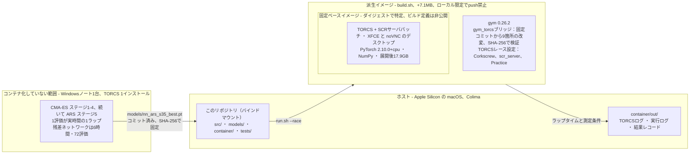

# 実機の TORCS に対してコントローラを走らせる

[English](README.md) | **日本語**

コントローラ本体とテストはどこでも動きますが、実際に「走らせる」には TORCS 本体、SCR
サーバのパッチ、そして特定の gym_torcs ブリッジが必要です。2013年ごろのシミュレータ一式
で、手作業で組み上げるのは骨が折れます。このディレクトリは、その手順を固定済みコンテナ
イメージに対する1コマンドまで縮めるためのものです。

```bash
bash container/build.sh     # 最初に1回：ブリッジを焼き込んだ派生イメージを作る
bash container/run.sh --race       # ステージ4の CMA-ES コントローラ
bash container/run.sh --race --nn  # ステージ5の残差NNコントローラ
```

`build.sh` は、固定ベースの上にシミュレータのブリッジと不足している Python 依存を1つ載せ
ただけの薄いイメージを作ります。`run.sh --race` はそれを起動し、TORCS を Corkscrew と SCR
ドライバに向け、車をグリッドに載せ、計測付きの評価走行を行い、結果レコードを
`container/out/result.json` に書き出します。

`build.sh` は省略できます。省略した場合、`run.sh` は主催者の素のイメージにフォールバック
し、ブリッジと `gym` を実行時に取得します。

## これは何であって、何ではないのか

これは**固定ベースの上に作った派生イメージ**であって、ソースから端まで再現できるコンテナ
ではありません。

### コンテナの中に入っているもの、入っていないもの



計測ラップはコンテナの中で完結します。そこで測っているパラメータと重みを生んだ探索は、
コンテナの外にあり、当時から一度も中に入っていません。

ベースイメージは主催者が Docker Hub で配布しているものです。ビルド定義が公開されていない
ため、ダイジェストによって正確に**特定**はできますが（`:latest` は使いません）、作り直す
ことはできません。その上に重ねたものはすべて [`Dockerfile`](Dockerfile) に書いてあり、
検証できます。特定されたベースと、再現できる派生。それがこのイメージの正確な姿です。

TORCS のソース自体は障害ではありません。上流の gym_torcs に `vtorcs-RL-color/` として SCR
ドライバごと公開されていますし、ベースイメージも `/opt/torcs-src` に持っています。ソース
からビルドするイメージは、この先の課題としてはあり得ます。ただし今回はそこまで踏み込みま
せん。自分でコンパイルしたバイナリは、これらのラップタイムを計測したバイナリとは別物で、
差し替えればこの作業で唯一確立できている基準を捨てることになるからです。

このリポジトリでソースから再現できる範囲は次のとおりです。

| 対象 | 再現の方法 |
|---|---|
| 実行用イメージ | `Dockerfile` と `build.sh`。ベースはロックに書かれたダイジェスト |
| gym_torcs ブリッジ | `prepare_bridge.py`。固定した上流コミットから、各改変を上流の原文に位置合わせして適用 |
| レース設定 | `configure_race.py`。TORCS 自身が生成した設定を書き換え |
| TORCS をグリッドに載せる | `race.sh`。確認と再試行付きの決め打ちメニュー操作 |
| 計測 | `src/run_eval.py`。CMA-ES と残差NNをフラグで明示 |
| 何を何の上で測ったか | `record_result.py` |

### 学習をコンテナに入れていない理由

このコンテナが再現するのは**計測**です。**学習**は一度も走らせていません。これは抜けでは
なく、意図して引いた境界です。

- **コンテナのほうが後発です。** `container/` を書いたのは2026-09-02で、CMA-ES と ARS の
  実行は、それ以前に開発用のノートPCで終わっていました。いま探索をコンテナ化しても、
  106.630秒を生んだ環境が遡って固定されるわけではありません。
- **1評価が実時間の1ラップです。** 残差ネットワークは6時間で72評価を要しました。CMA-ES の
  各ステージも同じ形です。1コマンドで終わる処理ではなく、数時間にわたって面倒を見る作業に
  なります。
- **実行経路が単発実行専用の作りです。** `race.sh` は TORCS を起動し、GUI のメニューを操作
  してグリッドに載せ（3回まで再試行）、`src/run_eval.py` を1回だけ呼びます。ブリッジは、
  呼び出し側の足下で TORCS を再起動する上流の挙動をやめて `ConnectionError` を投げるように
  変えてあり、学習スクリプトはすべて `env.reset(relaunch=False)` を呼びます。探索の途中で
  セッションが落ちたときに復帰する仕組みは、この経路にはありません。
- **依存関係の問題ではありません。** ベースイメージには PyTorch が入っていますので、残差
  ネットワークに追加レイヤは要りません。足りないのはプロセスの監視、再起動後にグリッドへ
  戻す手順、チェックポイントからの復帰です。計測経路より大きな作業になりますし、できあがる
  のは記録を取った環境とは**別の環境**です。

### 派生イメージを作る価値

派生イメージがないと、走らせるたびに `gym` を PyPI から、ブリッジのソースを GitHub から
取得することになります。ブリッジは `prepare_bridge.py` が SHA-256 で検証しますので上流の
変化には気づけますが、PyPI のホイールはバージョン指定だけですし、どちらのサービスも変わっ
たり消えたりし得ます。1回ビルドしておけば両方がイメージのレイヤに入り、実行が閉じます。

確認済みです。派生イメージは `--network none` でも走り、同じラップを出します。イメージに
焼き込んだブリッジは、実行時に組み立てたものと SHA-256 で一致します。

ディスクの負担はほとんどありません。派生レイヤは17.9GBのベースに対して**7.1MB**で、ベース
は共有されます。ビルドは2分ほどです。

このイメージはローカルで作るもので、**push してはいけません**。公開すると主催者のイメージ
を再配布することになります。

## 必要なもの

- **ディスク：** arm64 でダウンロード約6.1GB、展開後およそ18GBです。25GBは空けてください。
- **メモリ：** コンテナに8GBです。
- **エンジン：** Docker または Podman です。`run.sh` は見つかったほうを使います。指定する
  場合は `ENGINE` を設定してください。

Docker Desktop を使わない Apple Silicon の Mac では次のようにします。

```bash
brew install colima docker
colima start --cpu 4 --memory 8 --disk 80
```

arm64 と amd64 の両方のダイジェストが [`image-lock.json`](image-lock.json) にあり、`run.sh`
が `uname -m` で選びます。実際に取得して走らせたのは **arm64** だけです。amd64 はレジストリ
から記録しただけで、ここでは未検証です。

## 観測された結果

| | |
|---|---|
| ホスト | macOS 26.6.2、Apple Silicon、Colima 0.10.3、Docker CLI 29.7.2 / エンジン 29.5.2 |
| イメージ | `johnsloe/torcs-competition@sha256:fed57137…c4b9`（arm64） |
| コントローラ | `src/run_eval.py --no-nn`、ステージ4の CMA-ES パラメータ |
| コールドラップ | 114.130秒 |
| **ベストウォームラップ** | **108.538秒** |
| 過去の記録との対照 | 108.692秒 |

2026-09-02に5通りの経路で走らせました。元の非公開ブリッジのスナップショット、
`prepare_bridge.py` が組み直したブリッジ、新しいコンテナからの完全自動実行、新しいコンテナ
に置いたリポジトリのクリーンなコピー、そして `--network none` の派生イメージです。5通り
すべてで**コールドラップ114.130秒、ベストウォームラップ108.538秒が一致しました**。計測対象
ではない3周目だけが109.454秒と109.898秒に分かれました。

これは1台のマシンでの5回です。他のホストやアーキテクチャで同じラップタイムになる証拠では
ありませんし、許容幅を主張するものでもありません。言えるのは、ここでは繰り返し再現すること
と、他所で確かめるために必要なものはすべて記録してあることです。

同条件での再計測でもありません。過去の数字は Windows 上の10周 Quick Race・燃料消費ありで、
こちらは Practice・`-nofuel` です。どちらも自車1台、ダメージ無効です。両者の差と、両側で
直接は読み取れていない設定1つは [`docs/RACE_CONDITIONS.md`](../docs/RACE_CONDITIONS.md) に
まとめてあります。

## ブリッジを同梱せず組み直している理由

このリポジトリのラップタイムは、素の gym_torcs に対して測ったもの**ではありません**。手元
で改変したコピーに対して測ったもので、その改変は挙動を変えます。素の gym_torcs では再現
できません。

`prepare_bridge.py` は、そのコピーを
[ugo-nama-kun/gym_torcs](https://github.com/ugo-nama-kun/gym_torcs) のコミット `da5d6dd`
から組み直します。手を入れる前に、各ソースファイルを SHA-256 で検証します。改変の内容は
次のとおりです。

### `gym_torcs.py`

| 改変 | なぜ必要か |
|---|---|
| コンストラクタが TORCS を起動しない | プロセスは呼び出し側が持つ。上流の `os.system('torcs &')` はコンテナで既に動いているデスクトップと衝突する |
| `terminal_judge_start` 500 → 3000 | 上流は開始10秒ほどで遅ければエピソードを打ち切る。その時点の車はまだピットから加速中 |
| コース外での終了判定を削除 | Corkscrew は壁への寄せを意図して走る。上流は `track.min() < 0` で打ち切る |
| 逆走判定での終了を削除 | コークスクリュー区間で一瞬向きが逆になるのは復帰可能で、致命的ではない |
| snakeoil のギアしきい値を有効化 | **上流は1速に固定したままになる。** 挙動の差としては最大のもの |
| `agent_to_torcs` でギアを `int` に変換 | TORCS は浮動小数点のギアを受け付けない |
| SCR ポート 3101 → 3001 | 大会のポート。イメージが公開しているのもこちら |
| `end()` で `pkill torcs` をしない | プロセスは呼び出し側が持つ |
| `autostart.sh` をモジュールと同じ場所から解決 | 上流はカレントディレクトリ基準で解決する |

### `snakeoil3_gym.py`

| 改変 | なぜ必要か |
|---|---|
| 接続失敗時に TORCS を再起動せず `ConnectionError` を投げる | 上流は呼び出し側に断りなく TORCS を落として起動し直す。本当の失敗が隠れるうえ、プロセスを呼び出し側が持つ構成では成立しない |

元の作業コピーにあった見た目だけの整形は、意図して再現していません。上に挙げた改変がすべて
挙動に関わるものだけになり、差分がレビューできる状態に保たれます。組み直したブリッジは、
記録を出した作業コピーと構文木を突き合わせて確認しました。一致しなかったのは `reset_torcs`
だけで、同じ絶対パスの `autostart.sh` を書き方だけ変えて指しているもので、計測経路からは
呼ばれません。

## 改変の出どころ

主催者のスターターキットに入っていた `gym_torcs.py` は**上流とバイト単位で同一**でした。
つまり上に挙げた差分はすべてこのプロジェクト自身の作業であって、主催者の手が入ったもので
はありません。`snakeoil3_gym.py` には主催者の変更がありますが、`drive_example()`（デモ用
のドライバ）と `__main__` ブロックの中だけです。どちらもこの経路では動きませんし、ここで
再現もしていません。

主催者のスターターキット、講義資料、そこに同梱されていた TORCS のソースは、このリポジトリ
では**再配布していません**。

## 手順を分けて実行する

```bash
bash container/build.sh               # 派生イメージを作る
bash container/run.sh                 # コンテナを起動したままにする
bash container/run.sh --stop          # 停止して削除する

# コンテナの中で、準備だけしてレースはしない
docker exec -it torcs bash -lc \
  'bash /home/student/workspace/controller/container/race.sh --prepare'
```

コンテナが動いている間、デスクトップは <http://localhost:6080/vnc.html> で見られます。車の
挙動を眺めるのにも、メニュー操作が失敗したときに TORCS がどこで止まったかを確認するのにも
使えます。

素のベースイメージでは、`race.sh` が初回に `gym==0.26.2` を入れてブリッジを組み立てます。
派生イメージではどちらも用意済みですので、そのままレースに進みます。`gym` はベースイメージ
が持っていない唯一の依存で、すでにメンテナンスされておらず NumPy 2 について警告を出します
が、ブリッジが使っているのは形状を宣言する `gym.spaces` だけで、その値をここでは誰も読み
ません。固定ベースには PyTorch 2.10.0+cpu が入っていますので、残差ネットワークのために
レイヤを足す必要はありません。

## うまくいかなかったこと

- **`torcs -r <raceconfig>`** は決め打ちで動く綺麗な入口に見えますが、使えません。すぐに
  レースを開始し、まだ接続していないクライアントを待ってタイムアウトし、segfault します。
  実際に動くのは GUI のメニュー操作です。
- **上流 gym_torcs の `autostart.sh`** は、この TORCS ビルドでは Practice ではなく
  *Quick Race* に進みます。`race.sh` は独自の操作手順を持っています。
- **XFCE のスクリーンロッカー**は、数分放置するとキーボードを奪い、メニュー操作を黙って
  壊します。`race.sh` は最初にこれを停止します。
- **Colima が VM と共有するのは `$HOME` だけです。** ホームディレクトリの外にクローンすると
  空のディレクトリとしてマウントされ、`race.sh` が見つからないと報告されます。クローンは
  `$HOME` の下に置くか、`colima start --mount` でパスを追加してください。

## 残差ネットワークの走行

復元した106.630秒の残差ネットワークは `bash container/run.sh --race --nn` で計測できます。
TORCS を起動する前に、`models/nn_ars_s35_best.pt` を SHA-256 と、固定入力に対する出力の
両方で検証します。実行ログと結果レコードは `container/out/run_eval_residual.log` と
`container/out/result_residual.json` に分けて書き出します。既定の CMA-ES 実行は
`container/out/run_eval.log` と `container/out/result.json` のままです。

固定コンテナでの最初の計測は2026-09-08で、結果は次のとおりです。

| | |
|---|---|
| ホスト | macOS 26.6.2、Apple Silicon、Colima |
| イメージ | ステージ4の計測と同じ固定 arm64 イメージ |
| コールドラップ | 114.130秒 |
| ウォームラップ | 107.082秒、107.416秒 |
| **ベストウォームラップ** | **107.082秒** |
| 過去の残差NNの記録 | 106.630秒（+0.452秒） |
| 同じコンテナの CMA-ES 単体 | 108.538秒（−1.456秒） |

結果レコードは
[`results/stage5_nn_ars_container_2026-09-08.json`](../results/stage5_nn_ars_container_2026-09-08.json)
としてコミットしてあります。この1回で言えるのは、復元したネットワークが読み込めること、
ラップを完走すること、固定した環境でもステージ4のコントローラより速いことです。106.630秒
そのものの再現でも、分布の確認でも、コンテナと元の Windows のレース条件を同じにするもの
でもありません。
